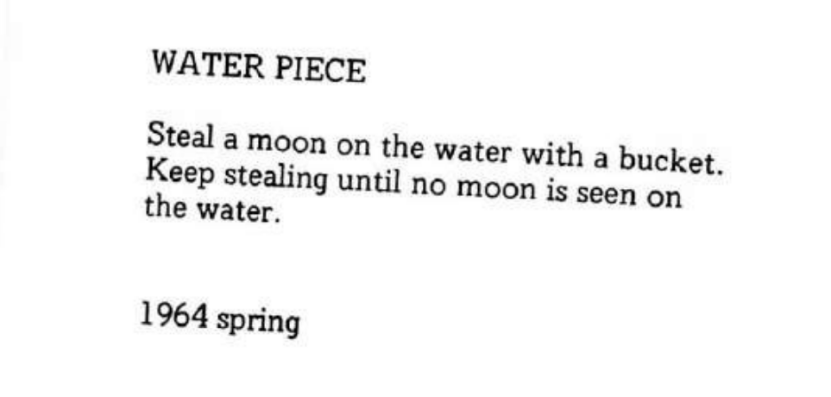

### HW05A
This visualization uses three layers of petals to represent hours, minutes, and seconds. In the background, a rotating sun and moon are drawn using the flowerclock function. The position and angle of these celestial elements change based on the hour, creating a dynamic background that reflects the passage of time throughout the day.

During the design process,I started with a single sun and moon, experimenting with different ways to replicate their natural characteristics. Then, I defined the starclock() function to display the sun during the day and the moon at night, with both rotating according to the hour. Finally, I created the flowerclock() function, where petals increase and change color over time (just like repeating the hour layer three times).

### HW05B
This file is inspired by the water piece,which is "Steal a moon on the water with a bucket.Keep stealing until no moon is seen onthe water." I created a small fish that follows the mouse movement and always faces the center of the moon. Each time the fish touches the moon, it changes color and grows slightly larger. Meanwhile, the moon gradually diminishes in size and brightness, but will never completely disappear, leaving a faint shadow in the water. This concept reflects my understanding of water piece, draining the moon just likes a romantic expression of eternity, and I hope my code could captures this interpretation.

During the design process, I began with a movable moon. By storing random parameters under specific conditions, I enabled the moon to shift its position randomly when the mouse hovers over it. Next, I drew a small fish that follows the mouse (hopefully resembling a fish) and added some looping patterns on its body. Lastly, I used the sin() function to create water ripples, making the surface appear more like a real body of water.